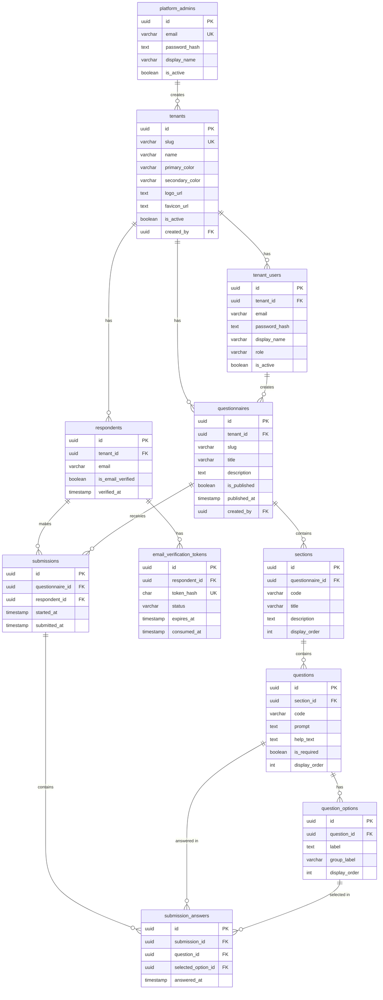

# GACS Questionnaire - Data Model V3 (Whitelabel, Admin-Managed)

## Goal

A **whitelabel questionnaire platform** with three distinct user roles:

- A **platform admin** (you) manages tenants -- creating, configuring, and deactivating whitelabel instances.
- A **tenant owner** (the client, e.g. Croonwolter&dros) creates and manages their own questionnaires, questions, and answer options.
- A **respondent** (anonymous visitor) fills in a published questionnaire, selects **exactly one option** per question, and leaves their **email address at the end**, which must be **verified** before the submission is finalized.

The GACS checklist (`checklist-technische-eisen-gacs-v3.pdf`) is modeled as **seed data**, not baked into the schema. The schema is generic enough for any single-choice questionnaire.

## Scope

**In scope:**

- Multi-tenant / whitelabel (branding per tenant).
- Admin users per tenant who create questionnaires.
- Questionnaire definition: sections, questions, answer options.
- Single-choice answers only (one selected option per question).
- Respondent with email address + email verification flow.
- Submission lifecycle (draft -> submitted).

**Out of scope:**

- Compliance engines, scoring, NEN-ISO class calculations.
- CRM, lead pipelines, organization/building entities.
- PDF generation (can be layered on later).
- Multi-choice, free-text, numeric, or date answers (single-choice only).
- Email templates and outbound message tracking.

## Functional Overview

### Roles

| Role | Who | Scope |
|---|---|---|
| **Platform Admin** | You (the developer/operator of the platform) | Global -- manages all tenants. |
| **Tenant Owner** | The client (e.g. Croonwolter&dros) | Their own tenant -- full control. |
| **Tenant Admin** | Extra user invited by the owner | Same tenant -- content management only. |
| **Respondent** | Anonymous visitor | Public -- fills in a published questionnaire, leaves email at the end. |

### What each role can do

**Platform Admin** (you)

- Create a new tenant (set name, slug, branding: logo, colors, favicon).
- View, update, or deactivate existing tenants.
- Create the first `owner` account for a tenant so the client can log in.
- See all tenants and their status at a glance.

**Tenant Owner** (the client)

Everything a Tenant Admin can do, plus:

- Update tenant branding (logo, colors, favicon).
- Invite, deactivate, or remove Tenant Admins.
- Delete a questionnaire (including all its sections, questions, options, and submissions).
- Publish or unpublish a questionnaire.
- Export or download submission data.

**Tenant Admin** (invited by owner)

Content management only -- no tenant settings, no user management, no destructive actions:

- Log in to the tenant's admin panel.
- Create a new questionnaire (title, slug, description).
- Edit existing questionnaires (title, description).
- Add, edit, and reorder sections within a questionnaire.
- Add, edit, and reorder questions within a section.
- Add, edit, and reorder answer options within a question.
- Optionally group options with a label (e.g. "Niet toegestaan" / "Wel toegestaan").
- View all submissions and their answers.

**Respondent** (anonymous visitor)

- Open a published questionnaire via its public URL.
- Walk through sections and questions in order.
- Select exactly one option per question.
- At the end, enter their email address.
- Receive a verification email with a link.
- Click the link to verify -- submission is finalized.

### Permission matrix

| Action | Platform Admin | Tenant Owner | Tenant Admin | Respondent |
|---|:---:|:---:|:---:|:---:|
| Create / deactivate tenants | x | | | |
| Create first owner account | x | | | |
| Update tenant branding | | x | | |
| Invite / remove Tenant Admins | | x | | |
| Create questionnaire | | x | x | |
| Edit questionnaire content | | x | x | |
| Delete questionnaire | | x | | |
| Publish / unpublish questionnaire | | x | | |
| Reorder sections / questions / options | | x | x | |
| View submissions | | x | x | |
| Export submission data | | x | | |
| Fill in questionnaire | | | | x |
| Submit email for verification | | | | x |

### End-to-end flow

```
┌─────────────────────────────────────────────────────────────────────┐
│ PLATFORM ADMIN                                                      │
│                                                                     │
│  1. Creates tenant "Croonwolter&dros"                               │
│     → sets slug, name, logo, colors                                 │
│  2. Creates owner account for the tenant                            │
│     → owner receives login credentials                              │
└──────────────────────────┬──────────────────────────────────────────┘
                           │
┌──────────────────────────▼──────────────────────────────────────────┐
│ TENANT OWNER (Croonwolter&dros)                                     │
│                                                                     │
│  3. Logs in to admin panel                                          │
│  4. Creates questionnaire "GACS Compliance Check"                   │
│  5. Adds sections:                                                  │
│     → "1. Verwarmingssysteem", "2. Warm tapwater", ...              │
│  6. Adds questions per section:                                     │
│     → "1.1 Warmteafgifte", "1.2 Warmteafgifte bij thermisch..." │
│  7. Adds options per question:                                      │
│     → group "Niet toegestaan": "Geen automatische regeling"        │
│     → group "Wel toegestaan": "Individuele temperatuurregeling"    │
│  8. Publishes the questionnaire                                     │
└──────────────────────────┬──────────────────────────────────────────┘
                           │
┌──────────────────────────▼──────────────────────────────────────────┐
│ RESPONDENT (anonymous visitor)                                      │
│                                                                     │
│  9.  Opens public URL:                                              │
│      app.example.com/croonwolterdros/gacs-compliance-check          │
│ 10.  Sees tenant branding (logo, colors)                            │
│ 11.  Walks through sections & questions, selects one option each    │
│      → answers are auto-saved as draft                              │
│ 12.  At the end: enters email address                               │
│ 13.  Receives verification email                                    │
│ 14.  Clicks verification link                                       │
│ 15.  Submission is finalized ✓                                      │
└──────────────────────────┬──────────────────────────────────────────┘
                           │
┌──────────────────────────▼──────────────────────────────────────────┐
│ TENANT OWNER                                                        │
│                                                                     │
│ 16.  Sees new submission in admin panel                             │
│ 17.  Reviews respondent's email + all selected answers              │
└─────────────────────────────────────────────────────────────────────┘
```

## ERD (DBML for dbdiagram.io)

```dbml
// ──────────────────────────────────────────────
// PLATFORM ADMIN (you)
// ──────────────────────────────────────────────

Table platform_admins {
  id uuid [pk]
  email varchar(255) [not null, unique]
  password_hash text [not null]
  display_name varchar(200)
  is_active boolean [not null, default: true]
  created_at timestamp [not null]
  updated_at timestamp [not null]
}

// ──────────────────────────────────────────────
// TENANT / WHITELABEL
// ──────────────────────────────────────────────

Table tenants {
  id uuid [pk]
  slug varchar(80) [not null, unique, note: 'URL-safe identifier, e.g. croonwolterdros']
  name varchar(200) [not null]
  primary_color varchar(7) [note: 'Hex color, e.g. #1A2B3C']
  secondary_color varchar(7)
  logo_url text
  favicon_url text
  is_active boolean [not null, default: true]
  created_by uuid [not null, ref: > platform_admins.id]
  created_at timestamp [not null]
  updated_at timestamp [not null]
}

// ──────────────────────────────────────────────
// TENANT USERS (owner + optional extra admins)
// ──────────────────────────────────────────────

Table tenant_users {
  id uuid [pk]
  tenant_id uuid [not null, ref: > tenants.id]
  email varchar(255) [not null]
  password_hash text [not null]
  display_name varchar(200)
  role varchar(20) [not null, default: 'owner', note: 'owner | admin']
  is_active boolean [not null, default: true]
  created_at timestamp [not null]
  updated_at timestamp [not null]

  Indexes {
    (tenant_id, email) [unique]
  }
}

// ──────────────────────────────────────────────
// QUESTIONNAIRE DEFINITION
// ──────────────────────────────────────────────

Table questionnaires {
  id uuid [pk]
  tenant_id uuid [not null, ref: > tenants.id]
  slug varchar(120) [not null, note: 'URL-safe, unique within tenant']
  title varchar(255) [not null]
  description text
  is_published boolean [not null, default: false]
  published_at timestamp
  created_by uuid [not null, ref: > tenant_users.id]
  created_at timestamp [not null]
  updated_at timestamp [not null]

  Indexes {
    (tenant_id, slug) [unique]
  }
}

Table sections {
  id uuid [pk]
  questionnaire_id uuid [not null, ref: > questionnaires.id]
  code varchar(20) [note: 'Optional short code, e.g. 1, 2, 3']
  title varchar(255) [not null]
  description text
  display_order int [not null, default: 0, note: 'Admin-reorderable. Default = creation order (set by app).']
  created_at timestamp [not null]
  updated_at timestamp [not null]
}

Table questions {
  id uuid [pk]
  section_id uuid [not null, ref: > sections.id]
  code varchar(40) [note: 'Optional short code, e.g. 1.1, 3.8, 7.4']
  prompt text [not null, note: 'The question text shown to the respondent']
  help_text text [note: 'Optional clarification shown below the question']
  is_required boolean [not null, default: true]
  display_order int [not null, default: 0, note: 'Admin-reorderable. Default = creation order (set by app).']
  created_at timestamp [not null]
  updated_at timestamp [not null]
}

Table question_options {
  id uuid [pk]
  question_id uuid [not null, ref: > questions.id]
  label text [not null, note: 'The option text shown to the respondent']
  group_label varchar(100) [note: 'Optional visual grouping, e.g. Niet toegestaan / Wel toegestaan']
  display_order int [not null, default: 0, note: 'Admin-reorderable. Default = creation order (set by app).']
  created_at timestamp [not null]
}

// ──────────────────────────────────────────────
// RESPONDENTS & EMAIL VERIFICATION
// ──────────────────────────────────────────────

Table respondents {
  id uuid [pk]
  tenant_id uuid [not null, ref: > tenants.id]
  email varchar(255) [not null]
  is_email_verified boolean [not null, default: false]
  verified_at timestamp
  created_at timestamp [not null]
  updated_at timestamp [not null]

  Indexes {
    (tenant_id, email) [unique]
  }
}

Table email_verification_tokens {
  id uuid [pk]
  respondent_id uuid [not null, ref: > respondents.id]
  token_hash char(64) [not null, unique, note: 'SHA-256 hash of the token sent via email']
  status varchar(20) [not null, default: 'issued', note: 'issued | consumed | expired | revoked']
  expires_at timestamp [not null]
  consumed_at timestamp
  created_at timestamp [not null]
}

// ──────────────────────────────────────────────
// SUBMISSIONS & ANSWERS
// ──────────────────────────────────────────────

Table submissions {
  id uuid [pk]
  questionnaire_id uuid [not null, ref: > questionnaires.id]
  respondent_id uuid [ref: > respondents.id, note: 'NULL during draft; set when respondent enters email at the end']
  started_at timestamp [not null]
  submitted_at timestamp [note: 'NULL until email is verified and submission is finalized']
  created_at timestamp [not null]
}

Table submission_answers {
  id uuid [pk]
  submission_id uuid [not null, ref: > submissions.id]
  question_id uuid [not null, ref: > questions.id]
  selected_option_id uuid [not null, ref: > question_options.id]
  answered_at timestamp [not null]

  Indexes {
    (submission_id, question_id) [unique, note: 'Exactly one answer per question per submission']
  }
}
```

## ERD Diagram (Mermaid)



## Table-by-Table Explanation

| Table | Purpose |
|---|---|
| `platform_admins` | Platform-level administrators (you). Can create, read, update, and deactivate tenants. Not scoped to any tenant. |
| `tenants` | Whitelabel organizations. Each tenant has its own branding (logo, colors), URL slug, and isolated data. Created by a platform admin. |
| `tenant_users` | Users scoped to a tenant. An `owner` has full control: branding, user management, publishing, deleting, and exporting. An `admin` is invited by the owner and can only manage questionnaire content (create, edit, reorder) and view submissions. |
| `questionnaires` | A named questionnaire belonging to a tenant. Has a publish lifecycle (`is_published` + `published_at`). URL is `/:tenant_slug/:questionnaire_slug`. |
| `sections` | Ordered groupings within a questionnaire (e.g. "1. Verwarmingssysteem onderdelen", "3. Airconditioningssysteem onderdelen"). Order is set by `display_order`; defaults to creation order, reorderable by admin. |
| `questions` | Individual questions within a section. Shown to the respondent with `prompt` text and optional `help_text`. Order is set by `display_order`; defaults to creation order, reorderable by admin. |
| `question_options` | Selectable options per question. Optional `group_label` for visual grouping (e.g. "Niet toegestaan" vs "Wel toegestaan"). Only **one** option can be selected per question. Order is set by `display_order`; defaults to creation order, reorderable by admin. |
| `respondents` | People who fill in questionnaires. Scoped to a tenant for data isolation. Email must be verified. |
| `email_verification_tokens` | Token records for email verification. A hashed token is stored; the raw token is sent via email. Status lifecycle: `issued` -> `consumed` / `expired` / `revoked`. |
| `submissions` | One questionnaire attempt. `respondent_id` is `NULL` during the draft phase (respondent enters email at the end). `submitted_at` is `NULL` until email is verified and submission is finalized. |
| `submission_answers` | The selected option for each question in a submission. Unique constraint ensures exactly **one answer per question per submission** (single-choice). |

## Relationships Summary

```
platform_admins 1──* tenants    (a platform admin creates tenants)

tenants 1──* tenant_users       (a tenant has many users)
tenants 1──* questionnaires     (a tenant has many questionnaires)
tenants 1──* respondents        (a tenant has many respondents)

tenant_users 1──* questionnaires (a tenant user creates questionnaires)

questionnaires 1──* sections    (a questionnaire has ordered sections)
sections 1──* questions         (a section has ordered questions)
questions 1──* question_options (a question has multiple options)

respondents 1──* submissions    (a respondent can have multiple submissions)
questionnaires 1──* submissions (a questionnaire receives many submissions)

submissions 1──* submission_answers              (a submission has many answers)
submission_answers *──1 questions                 (each answer is for one question)
submission_answers *──1 question_options           (each answer selects one option)

respondents 1──* email_verification_tokens       (a respondent can have multiple tokens)
```

## Normalization Notes

- **1NF:** No repeating groups. Each answer is one row in `submission_answers`. Options are rows in `question_options`, not comma-separated values.
- **2NF:** No partial dependencies. The unique pair `(submission_id, question_id)` in `submission_answers` fully determines the selected option.
- **3NF:** No transitive dependencies. Tenant branding lives in `tenants`, not duplicated across questionnaires. Token status is a constrained `varchar`, not a derived field.

## Recommended Constraints

| Constraint | Table | Rule |
|---|---|---|
| Single choice | `submission_answers` | `UNIQUE (submission_id, question_id)` — already in schema. |
| Option belongs to question | `submission_answers` | `selected_option_id` must reference a `question_options` row belonging to the same `question_id`. Enforce via trigger or application logic. |
| Token status values | `email_verification_tokens` | `CHECK (status IN ('issued', 'consumed', 'expired', 'revoked'))`. |
| Token expiry | `email_verification_tokens` | `CHECK (expires_at > created_at)`. |
| Tenant user role values | `tenant_users` | `CHECK (role IN ('owner', 'admin'))`. |
| Published gate | `submissions` | Only allow submissions for questionnaires where `is_published = true`. Enforce in application or via DB policy. |
| Verified before submit | `submissions` | `submitted_at` should only be set when `respondent_id` is not `NULL` and the respondent's email is verified (`respondents.is_email_verified = true`). Enforce in application. |
| Respondent required for submit | `submissions` | `respondent_id` must be set before `submitted_at` can be set. During draft phase, `respondent_id` is `NULL` (email not yet provided). Enforce in application. |
| Slug format | `tenants`, `questionnaires` | `CHECK (slug ~ '^[a-z0-9-]+$')` — lowercase alphanumeric and hyphens only. |

## Email Verification Flow

```
1. Respondent fills in the questionnaire (answers are saved to a draft submission).
2. At the end of the questionnaire, the respondent enters their email address.
3. System creates a `respondents` row (is_email_verified = false) and links it to the submission.
4. System generates a random token, stores SHA-256 hash in `email_verification_tokens` (status = 'issued').
5. Raw token is sent to the respondent's email as a verification link.
6. Respondent clicks the link.
7. System hashes the token from the URL, looks up the matching row.
8. If found, not expired, and status = 'issued':
   - Set token status to 'consumed', set consumed_at.
   - Set respondent is_email_verified = true, set verified_at.
9. Submission is finalized (submitted_at is set).
```

## GACS Checklist as Seed Data

The GACS checklist from `checklist-technische-eisen-gacs-v3.pdf` maps to this schema as follows:

| Checklist concept | Table | Example |
|---|---|---|
| Section "1. Verwarmingssysteem onderdelen" | `sections` | `code = '1'`, `title = 'Verwarmingssysteem onderdelen'` |
| Item "1.1 Warmteafgifte" | `questions` | `code = '1.1'`, `prompt = 'Warmteafgifte'` |
| "Niet toegestaan" options | `question_options` | `group_label = 'Niet toegestaan'`, `label = 'Geen automatische temperatuurregeling'` |
| "Wel toegestaan" options | `question_options` | `group_label = 'Wel toegestaan'`, `label = 'Individuele temperatuurregeling per ruimte'` |

All 7 sections (Verwarming, Warm tapwater, Airconditioning, Ventilatie, Verlichting, Zonwering, Technisch gebouwmanagement) and their sub-items (1.1 through 7.7) are loaded as seed data, not hard-coded into the schema.

## Example URL Structure

```
https://{custom-domain}/                         → tenant landing (resolved by domain)
https://app.example.com/{tenant_slug}            → tenant landing (resolved by slug)
https://app.example.com/{tenant_slug}/{q_slug}   → questionnaire form
https://app.example.com/{tenant_slug}/admin       → admin panel
```

## Key Design Decisions

| Decision | Rationale |
|---|---|
| **Respondents scoped to tenant** | Data isolation between whitelabel instances. Same email in tenant A and B are separate respondent records. GDPR-friendly. |
| **No `questionnaire_versions` table** | Keeps the model simple. If versioning is needed later, add a `version` column or a separate versions table. For now, create a new questionnaire for changes. |
| **`group_label` on options instead of separate table** | The "Niet toegestaan" / "Wel toegestaan" grouping is display-only. A simple nullable string avoids an extra join. |
| **`status` as constrained varchar, not lookup table** | Token status has a fixed, small set of values. A CHECK constraint is simpler and equally safe. |
| **Single-choice enforced by unique constraint** | `UNIQUE (submission_id, question_id)` in `submission_answers` guarantees exactly one selected option per question. No multi-select support needed. |
| **Separate `platform_admins` and `tenant_users`** | Platform admins operate above tenant scope (managing tenants). Tenant users are scoped to their tenant. Keeps authorization logic clean -- no need for cross-tenant role checks. |
| **password_hash in DB** | Simple auth for all admin roles. In production, consider delegating to Supabase Auth or similar. |
| **`display_order` for reordering** | Sections, questions, and options all have a `display_order` column. On creation the app assigns the next sequential value (creation order). Admins can reorder items at any time by updating `display_order`. The frontend always sorts by `display_order ASC`. |

## Source

- `.docs/checklist-technische-eisen-gacs-v3.pdf`
- `.docs/briefing.md`
